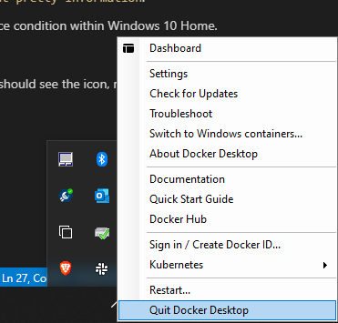

# Docker issues on Windows 10  

After several problems during the lab session last Friday (09/10/2020), this file will list some possible solutions.

## Read-only error 

Last Friday, a major update of Visual Studio Code (version 1.50) had several major changes for the devcontainers. Instead of using the images from docker hub (such as the continuumio/anacoda3 image), Microsoft started to use their own container registry called Microsft Container Registry (MCR). MCR had issues last Friday, resulting in corrupt layers that were downloaded. (So yes, Murphy was present :wink:). This caused the most common errors, for example the read-only error when building the devcontainer in Visual Studio Code. Normally, this issue is resolved now, but the download time of several layers can still take a lot of time (see the current issues on [https://github.com/microsoft/containerregistry/issues](https://github.com/microsoft/containerregistry/issues)).

In case you still have issues, try to remove your docker cache with the following commands (from a powershell windows) (make sure to close visual studio code first):

```bash
 docker stop $(docker ps -aq)
 docker rm $(docker ps -aq)
 docker image rm $(docker image ls -aq)
 docker builder prune -a
```
Afterwards, start Visual Studio Code again. This will download the container image again (can be slow!).

## Error printing pretty info - General problems
Some students had an issue with Docker with the following fault messages:
* In powershell, when executing the command `docker ps -a`, the following error occured: `docker error response from daemon ...`
* When starting Visual Studio Code with a remote execution environment, the process was interrupted before building the image with an error `cannot print pretty information`.

Mostly, both problems occur and the origin is probably a race condition within Windows 10 Home.

**You can resolve this issue as follows:**
1. Stop docker desktop (in the bottom right corner you should see the icon, right click and select "Quit Docker Desktop")

   

2. Open powershell and type following commands:

   ```bash
   wsl --shutdown
   wsl --unregister docker-desktop
   ```

3. Start Docker Desktop (admin is normally not required)

This problems probably only occurs when Docker Desktop is starting automatically when Windows starts up. You can disable this by clicking on settings (in the same menu as the image above) and disable the option to "Start Docker Desktop when you log in"

