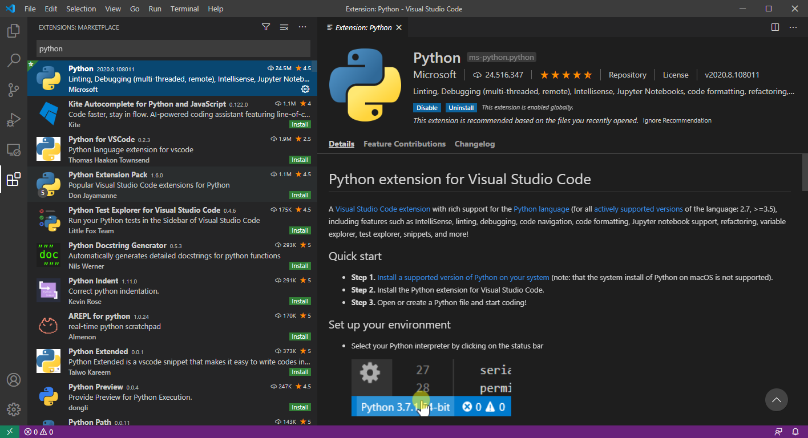
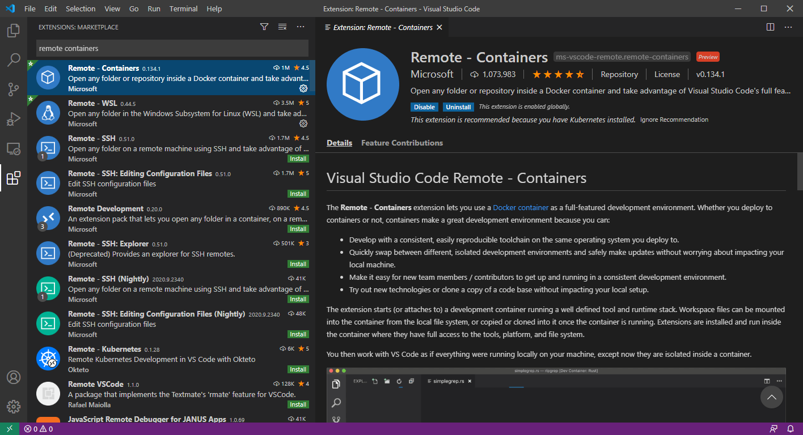

# GDV specific installation manual for Windows

These instructions install the tools specific to the course "Gedistribueerde gegevensverwerking".

> *Note: Please run [the general setup](./setup-windows.md) before following these instructions.*

1. Start Visual Studio Code
1. Navigate to Extensions

   

1. Search the Python extension and install

   

1. Search for the Remote containers extension and install
  
   

1. Now you are ready to start the GDV labs!

> *Note: Also follow the [Softwareontwikkeling en -beheer installation manual](./devops-setup-windows.md) if you also follow that course.*
