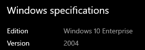
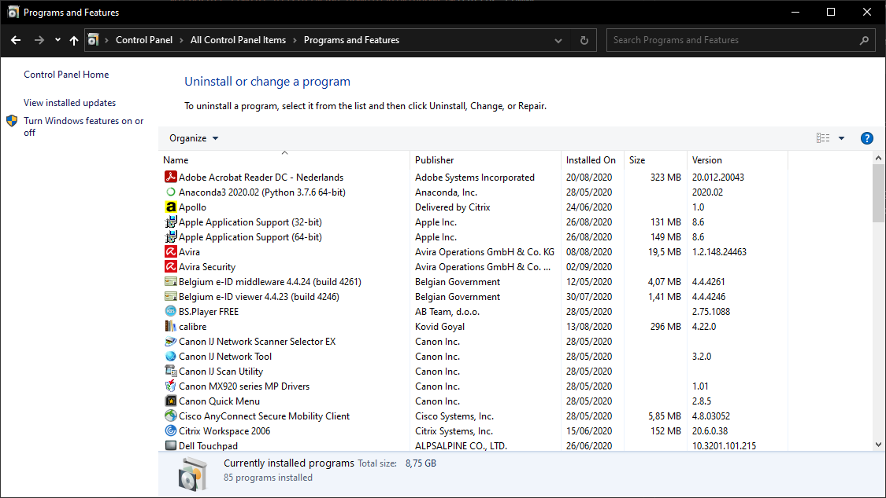
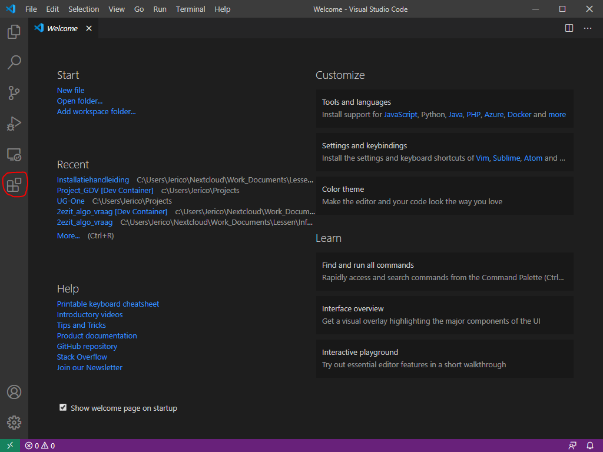
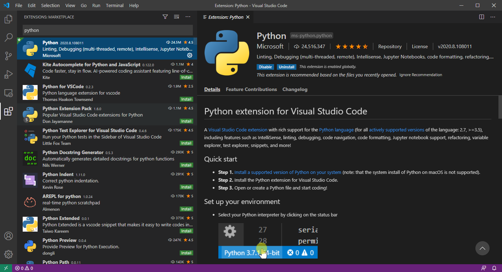
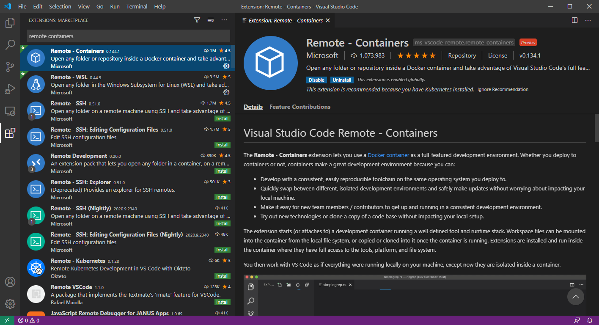

# General installation manual for Windows

## Prepare Windows

Install the latest updates for Windows 10. You need at least version 2004. You can download this update through [https://www.microsoft.com/nl-nl/software-download/windows10](https://www.microsoft.com/nl-nl/software-download/windows10). You can check your version through "Settings" > "System" > "About" > "Windows Specifications".



> ⚠️ The labs require at least version 2004 of Windows 10 Home, Pro, Enterprise or Education. **Windows 11 is not yet supported for GDV. We will notify the students once everything required for our labs is compatible with Windows 11.*

Enable additional Windows features

1. Go to control panel (configuratiescherm) > Program and Features
1. On the left side you should see an option to "Turn Windows features on or off"

   

1. Select the following features:
   * Containers *(optional; Not available for Windows Home users)*
   * Hyper-V *(optional; Not available for Windows Home users)*
   * Virtual Machine Platform
   * Windows Hypervisor Platform
   * Windows Subsystem for Linux
1. Click on "OK" and these features will be installed on your PC. Some reboots will be required during the installation process.

## Git installation

1. Install git using the Windows installer from [their website](https://git-scm.com/). **Use the default settings of the git installer.**
1. Open the "git bash" program from the start menu. This will open a commandline shell. Configure your username and email using the following commands.

   ```bash
   # Run this inside git bash with the correct email and name
   git config --global user.email "you@example.com"
   git config --global user.name "Your Name"
   ```

## Zoom installation

Zoom will be used for presentations during labs and to help students remotely. Because the Zoom web client does not support remote control, you need to install the Zoom desktop app.

Download the Zoom Client for Meetings from [https://zoom.us/download](https://zoom.us/download) and install it.

When you start Zoom, login through "SSO", use the `ugent-be` domain and use your UGent email address. The first time you login, an account will be made for you automatically. For more instructions (only in Dutch) see [Zoom handleiding studenten](https://web.microsoftstream.com/video/2096e73b-f69b-4c84-b2da-a27e06da6d34?referrer=https:%2F%2Fonderwijstips.ugent.be%2Fnl%2Ftips%2Fzoom%2F) (login using your UGent email).

## Slack installation

* Download and install Slack from [https://slack.com/intl/en-be/downloads/windows](https://slack.com/intl/en-be/downloads/windows).

Use the link in one of the announcements on Ufora to connect to the GDV workspace.

## Docker installation

> ⚠️ Older tutorials might mention *Docker Toolbox* for Windows. However, this does not support all the features required for GDV so **you cannot use Docker Toolbox**.

* Install Docker Desktop from [https://docs.docker.com/desktop/windows/install/](https://docs.docker.com/desktop/windows/install/).
  * Make sure to select the stable version
* Follow to on-screen instructions
  * Make sure to enable the following option (already enabled by default): "Use the WSL 2 based engine"
  * Start Docker after the installation.
* If you receive a notification about a kernel update:
  * Follow the instructions provided [here](https://docs.microsoft.com/en-us/windows/wsl/install#install) to switch to WSL2. Reboot afterwards.
  * Docker should now start succesfully. If you receive an `IOException`, make sure your virtualisation is enabled in your BIOS.

## Visual Studio Code

1. Download and install Visual Studio Code from [https://code.visualstudio.com/](https://code.visualstudio.com/)
   * Enable the option to add "code" to PATH

1. Start Visual Studio Code
1. Navigate to Extensions

   

1. Search the Python extension and install

   

1. Search for the Remote containers extension and install
  
   

1. Now you are ready to start the labs! Note that each lab might have additional installation instructions. Make sure to complete those before that specific lab starts.

> Are you having problems during the installation? Please create an issue in [the docs repository](https://github.ugent.be/GDV/docs/issues). We speak both Dutch and English.
