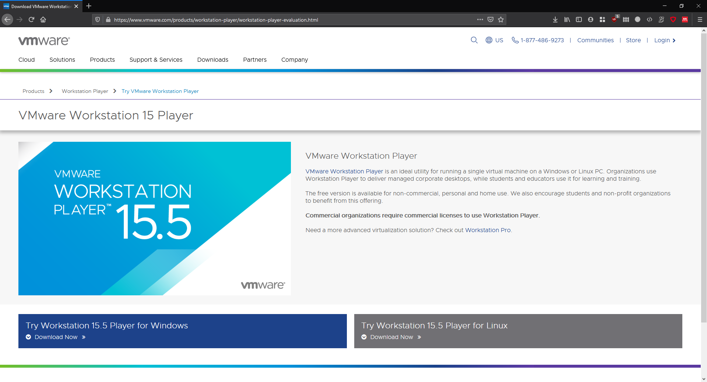

# General installation manual for Windows

These courses use Docker Desktop on Windows. This is the recommended and most powerful way to run Docker on Windows, but it requires Hyper-V; the Microsoft virtualization hypervisor. As of writing this, VirtualBox still does not fully support Hyper-V, so **VirtualBox will not work anymore** after running these instructions. Other courses of Industrieel Ingenieur Informatica will use VMWare to run virtual machines, because that supports Hyper-V.

Older tutorials might mention *Docker Toolbox* for Windows. However, this does not support all the features required for GDV and DevOps so **you cannot use Docker Toolbox**.

> *Note: If you absolutely need to use VirtualBox, it is possible to create a dualboot of Windows 10 with Hyper-V enabled and Windows 10 without Hyper-V. **We do not recommend this approach** but we can provide some information if you are interested.*

You can download VMWare from [https://www.vmware.com/products/workstation-player/workstation-player-evaluation.html](https://www.vmware.com/products/workstation-player/workstation-player-evaluation.html) by clicking on "Try Workstation 15.5 Player for Windows". Installing VMWare is not required for these courses.



## Requirements

* Windows 10 - version 2004: Download through [https://www.microsoft.com/nl-nl/software-download/windows10](https://www.microsoft.com/nl-nl/software-download/windows10) and follow to on-screen instructions
  * You can check your version through settings > system > about > "Windows Specifications"

  

* Enable some Windows modules
  * Go to control panel (configuratiescherm) > Program and Features
  * On the left side you should see an option to "Turn Windows features on or off"
  
  

* Select the following features:
  * Containers *(Not available for Windows Home users)*
  * Hyper-V *(Not available for Windows Home users)*
  * Virtual Machine Platform
  * Windows Hypervisor Platform
  * Windows Subsystem for Linux
* Click on "OK" and these features will be installed on your PC. Some reboots will be required during the installation process.
* Git must be installed in configured on your system

## Git installation

1. Install git using the Windows installer from [their website](https://git-scm.com/). **Use the default settings of the git installer.**
1. Open the "git bash" program from the start menu. This will open a commandline shell. Configure your username and email using the following commands.

   ```bash
   # Run this inside git bash with the correct email and name
   git config --global user.email "you@example.com"
   git config --global user.name "Your Name"
   ```

## Zoom installation

Zoom will be used for presentations during labs and to help students remotely. Because the Zoom web client does not support remote control, you need to install the Zoom desktop app.

Download the Zoom Client for Meetings from [https://zoom.us/download](https://zoom.us/download) and install it.

When you start Zoom, login through "SSO", use the `ugent-be` domain and use your UGent email address. The first time you login, an account will be made for you automatically. For more instructions (only in Dutch) see [Zoom handleiding studenten](https://web.microsoftstream.com/video/2096e73b-f69b-4c84-b2da-a27e06da6d34?referrer=https:%2F%2Fonderwijstips.ugent.be%2Fnl%2Ftips%2Fzoom%2F) (login using your UGent email).

## Microsoft Teams installation

* Download the Microsoft Teams application from [https://www.microsoft.com/nl-be/microsoft-365/microsoft-teams/download-app](https://www.microsoft.com/nl-be/microsoft-365/microsoft-teams/download-app)
  * Follow the on-screen instructions
  * Use your UGent-account to login

## Docker installation

* Install Docker for Windows CE edition from:
  * [https://docs.docker.com/docker-for-windows/install-windows-home/](https://docs.docker.com/docker-for-windows/install-windows-home/) for Windows 10 Home users
  * [https://docs.docker.com/docker-for-windows/install/](https://docs.docker.com/docker-for-windows/install/) for Windows 10 Enterprise or Pro users
  * Make sure to select the stable version
* Follow to on-screen instructions
  * Make sure to enable the following option (already enabled by default): "Use the WSL 2 based engine"
  * Start Docker after the installation.
* If you receive a notification about a kernel update:
  * Follow the instructions provided [here](https://docs.microsoft.com/en-us/windows/wsl/install-win10#step-4---download-the-linux-kernel-update-package) and install the WSL2 Linux kernel update under Step 4. Reboot afterwards.
  * Execute the command in an elevated Powershell illustrated in Step 5: `wsl --set-default-version 2`
  * Docker should now start succesfully. If you receive an `IOException`, make sure your virtualisation is enabled in your BIOS.

## Visual Studio Code

1. Download and install Visual Studio Code from [https://code.visualstudio.com/](https://code.visualstudio.com/)
   * Enable the option to add "code" to PATH

1. Start Visual Studio Code
1. Navigate to Extensions

   

1. Search the Python extension and install

   

1. Search for the Remote containers extension and install
  
   

1. Now you are ready to start the labs! Note that each lab might have additional installation instructions. Make sure to complete those before that specific lab starts.

> Are you having problems during the installation? Please create an issue in [the docs repository](https://github.ugent.be/GDV/docs/issues). We speak both Dutch and English.
